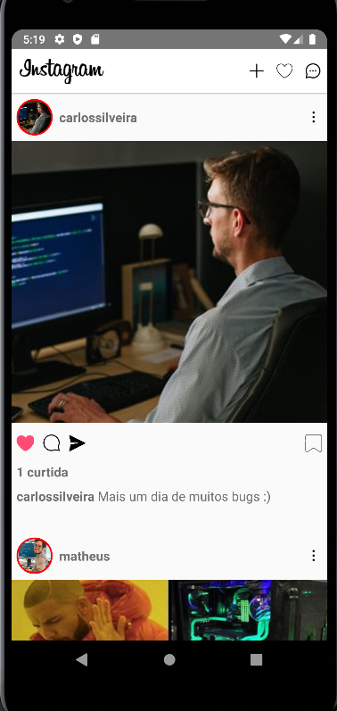

# Instaclone

  
  
  

 

Clone do Instagram desenvolvido durante o curso de React-Native.

  

## Como usar esta aplicação

* Clone este repositório na sua máquina.
* Abra o emulador Android do Android Studio (deve-se manter ele aberto para funcionar).
* Entre no arquivo clonado e, no terminal, execute o comando: ``yarn android``

## Tecnologias utilizadas

- [x] React Native
- [x] Jsx
- [x] Javascript 

## Desenvolvimento

<table>
  <tr>
    <td border="1px solid #ddd" align="center">
      <a href="https://github.com/wesleysantossts">
        
         
        Wesley Santos
      </a>
    </td>
  </tr>
</table>
